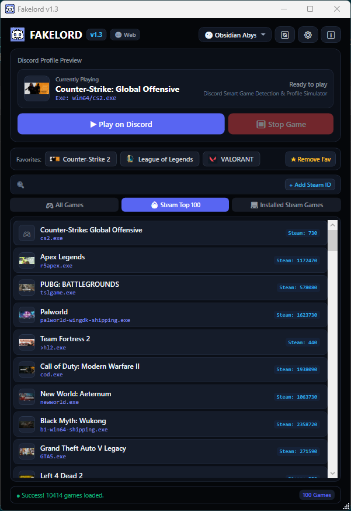
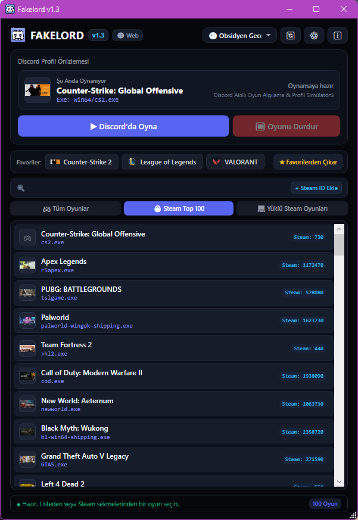

  

  # 🎮 FakeLord
  ### Lightweight & Smart Discord Game Activity Simulator
  **Show any game on your Discord profile with zero hardware load & 100% background stealth.**

   

  

    
    &nbsp;&nbsp;&nbsp;&nbsp;
    
  

   

  

    
    
    
    
    
    
    
  

---

# 🇬🇧 English Documentation

> [!TIP]
> Looking for Turkish documentation? **[Click here to switch to Türkçe](#-türkçe-dokümantasyon)**.

## 📖 Overview

**FakeLord** is a next-generation desktop utility designed to emulate game processes for **Discord Rich Presence / Activity Status** without downloading or launching heavy games. 

Using an ultra-lightweight **Ghost Process Architecture**, FakeLord simulates official game executables with **0.0% CPU usage and less than 5 MB of RAM**. Discord automatically identifies your status as verified in-game, showing official art banners and game titles to your friends.

---

## 📸 Screenshots (English UI)

  
  
<em>FakeLord English Interface — Modern Discord & Steam integration with real-time profile preview.</em>

---

## ✨ Key Features

- **🎮 4,000+ Discord Detectable Games:** Instantly searchable offline & online synchronized database.
- **🔥 Steam Top 100 Live Catalog:** Discover currently trending games and play them with one click.
- **💻 Local Steam Library Detection:** Automatically scans your installed Steam games and lists them.
- **🔍 Custom Steam AppID Search:** Enter any Steam AppID (e.g., `730` for CS2) to pull its title, cover art, and executable name on the fly.
- **⚡ Ghost Runner Isolation:** Clones and runs invisible processes using `HaYTooL.exe` template. No 3D render, no GPU burden, no memory leaks.
- **⭐ Dynamic Favorites System:** Keep your go-to titles pinned on top with automated bar expansion.
- **🔔 Modern Cyberpunk System Tray:** Anti-aliased dark-mode context menu with live game status, stop button, quick launch favorites, and settings.
- **🎨 8 Premium Themes:** Obsidian Abyss, Discord Nitro, Cyber Matrix, Synthwave Neon, and more.
- **🔄 Auto-Updater & GitHub Release Checker:** Direct notification when a new version is released.
- **🛡️ 100% Discord ToS Safe:** Zero account credentials, tokens, or injection needed. Zero ban risk.

---

## 🚀 Download & Installation

1. Download the latest release from the [Releases](https://github.com/HaYToKoRaZ/FakeLord/releases) section:
   - **`FakeLord_Setup.exe`**: Standard Windows installer with start menu and desktop shortcuts.
   - **`FakeLord_Portable.zip`**: Portable version, extract and run anywhere without installation.
2. Launch `FakelordUI.exe`.
3. Select any game from the list (or search by title/AppID).
4. Click **▶ Play on Discord** (or double-click the game card).
5. Open Discord and see your activity live!

---

 

---

# 🇹🇷 Türkçe Dokümantasyon

> [!TIP]
> İngilizce dokümantasyona dönmek için: **[English Documentation](#-english-documentation)**.

## 📖 Genel Bakış

**FakeLord**, devasa boyutlardaki oyunları bilgisayarınıza indirip kurmanıza veya sisteminizi yormanıza gerek kalmadan, Discord profilinizde istediğiniz oyunu oynuyormuş gibi göstermenizi sağlayan akıllı bir **Discord Etkinlik Simülatörüdür**.

Gelişmiş **Hayalet Süreç (Ghost Process)** mimarisi sayesinde, sistemde **%0 CPU ve 5 MB'ın altında RAM** tüketimiyle çalışır. Discord profilinizde arkadaşlarınız oyunu resmî doğrulanmış logosu ve afişiyle birlikte canlı olarak görür.

---

## 📸 Ekran Görüntüleri (Türkçe Arayüz)

  
  
<em>FakeLord Türkçe Arayüzü — Canlı Discord kart önizlemesi, dinamik favoriler ve hızlı filtreler.</em>

---

## ✨ Öne Çıkan Özellikler

- **🎮 4.000+ Discord Detectable Oyunu:** Discord'un resmî doğrulanmış veri tabanındaki tüm oyunlar elinizin altında.
- **🔥 Steam Top 100 Canlı Kataloğu:** Steam'in en çok oynanan popüler oyunlarını anlık çeker ve tek tıkla simüle eder.
- **💻 Yüklü Steam Oyunları Tespiti:** Bilgisayarınızdaki Steam kütüphanesini otomatik tarar ve listeler.
- **🔍 Manuel Steam AppID Desteği:** Herhangi bir oyunun AppID numarasını yazarak kapak görseli ve exe adıyla birlikte anında ekleyin.
- **⚡ Sıfır Kaynak Tüketimi (Ghost Runner):** `HaYTooL.exe` şablonu üzerinden arka planda 3D render veya döngü olmadan çalışan hayalet süreç mimarisi.
- **⭐ Dinamik Otomatik Genişleyen Favoriler:** Favori oyunlarınız için akıllı, otomatik genişleyen ergonomik üst bar.
- **🔔 Yenilenmiş Modern Sistem Tepsisi:** Discord Cyber Dark temalı, canlı durum göstergeli, favorileri hızlı başlatma destekli sağ tık menüsü.
- **🎨 8 Farklı Tema Seçeneği:** Obsidyen Gece, Discord Nitro, Matris, Siberpunk ve daha fazlası.
- **🔄 Otomatik GitHub Sürüm Denetimi:** Yeni güncelleme çıktığında uygulama içinden toast bildirimi.
- **🛡️ %100 Discord Kurallarıyla Uyumlu:** Hesap bilgisi veya şifre istemez, bellek enjeksiyonu yapmaz, ban riski kesinlikle yoktur.

---

## 🚀 İndirme ve Hızlı Başlangıç

1. En son sürümü [Releases](https://github.com/HaYToKoRaZ/FakeLord/releases) sayfasından indirin:
   - **`FakeLord_Setup.exe`**: Klasik Windows kurulum sihirbazı.
   - **`FakeLord_Portable.zip`**: Kurulum gerektirmeyen taşınabilir sürüm.
2. `FakelordUI.exe` dosyasını çalıştırın.
3. Listeden istediğiniz oyuna tıklayın veya arama kutusuna adını yazın.
4. **▶ Discord'da Oyna** butonuna basın (veya oyuna çift tıklayın).
5. Discord profilinizi kontrol edin; oyununuz anında aktif!

---

## ❓ Sıkça Sorulan Sorular (SSS)

<b>1. Discord hesabımdan ban yer miyim?</b>

Hayır, kesinlikle hayır. FakeLord hiçbir Discord tokenı, şifresi veya API enjeksiyonu kullanmaz. Discord'un kendi yerel işletim sistemi süreç tarama mekanizmasını (Process Detection) kullanır. Discord için bu, bilgisayarınızda bir programın açık olmasından farksızdır.

<b>2. Bilgisayarımda oyunun gerçekten yüklü olması gerekiyor mu?</b>

Hayır! FakeLord'un temel varlık sebebi budur. 100 GB'lık oyunları indirmeden tek bir tıkla Discord profilinizde oynuyor olarak görünebilirsiniz.

<b>3. Sistemim yavaşlar mı?</b>

FakeLord hayalet süreçleri uykuda (Idle Sleep) bekler. CPU tüketimi %0, RAM tüketimi ise 5 MB civarındadır. Oyun oynarken veya çalışırken arka planda açık olduğunu bile hissetmezsiniz.

---

## 👤 Geliştirici & Topluluk

- **Geliştirici:** HaYTo
- **Resmi Web Sitesi:** [haytool.online/FakeLord](https://haytool.online/FakeLord/)
- **X (Twitter):** [@HaYTo](https://x.com/HaYTo)
- **Hata Bildirimi & Öneri:** [GitHub Issues](https://github.com/HaYToKoRaZ/FakeLord/issues)
- **E-posta:** `korazhayto@gmail.com`

---

## 📜 Lisans

Bu proje **MIT Lisansı** altında lisanslanmıştır. Açık kaynaklı ve topluluk odaklıdır.
